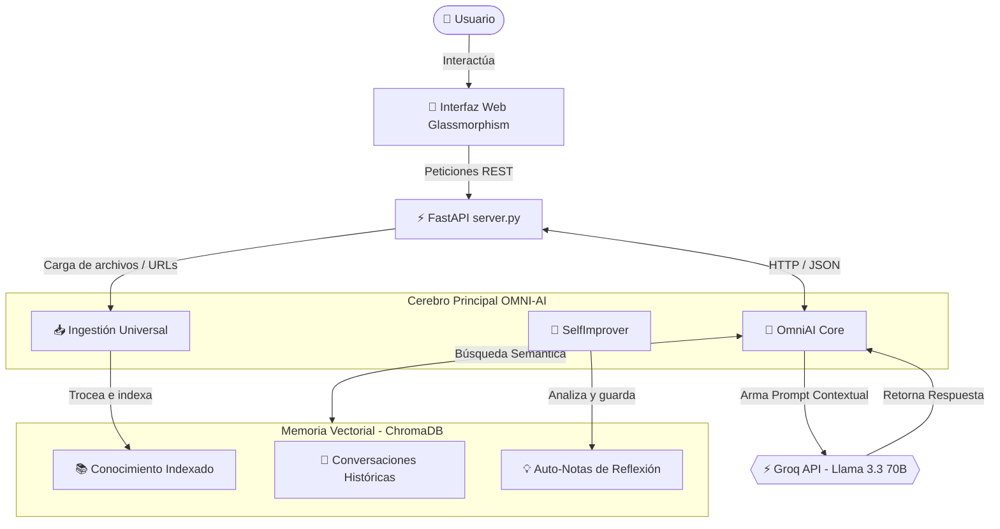

# 🧠 OMNI-AI · Sistema Cognitivo General con RAG y Auto-aprendizaje

<div align="center">
  
  
  
  
</div>

<br />

**OMNI-AI** es un asistente de inteligencia artificial avanzado y modular diseñado para funcionar 100% gratis en la nube mediante **Groq API** y embeddings locales en tu máquina. Cuenta con **RAG híbrido (memoria vectorial)**, **memoria persistente a largo plazo**, **auto-aprendizaje continuo** y una **interfaz gráfica web premium estilo glassmorphism**.

---

## 🌟 Características Principales

* **🧠 Cerebro Cognitivo Avanzado:** Utiliza el modelo ultra-potente y rápido **LLaMA 3.3 70B** a través de la API gratuita de Groq.
* **📚 Base de Conocimiento RAG Híbrida:** Integra **ChromaDB** localmente como base de datos de vectores para almacenar y buscar información relevante semánticamente.
* **⚡ Embeddings Offline:** Genera vectores en local usando la librería `sentence-transformers` (`all-MiniLM-L6-v2`), corriendo eficientemente en la CPU de cualquier ordenador sin necesidad de tarjeta gráfica (GPU).
* **📥 Ingestión Universal de Datos:** Absorbe y memoriza conocimiento nuevo al instante desde tres canales:
  * **Páginas Web (Scraping limpio):** Pega una URL y OMNI extraerá su contenido eliminando basura.
  * **Documentos Físicos:** Carga archivos **PDF** o de **Texto Plano (.txt)** directamente.
  * **Registro Manual:** Inserta ideas, textos o apuntes rápidos directamente desde el panel.
* **🔄 Ciclo de Auto-Mejora (Self-Improvement):** La IA evalúa autónomamente sus propias respuestas cada 3 turnos, redactando notas de aprendizaje y trazándose objetivos concretos para optimizar respuestas futuras.
* **💻 Interfaz Web Premium (SPA):** Una experiencia visualmente asombrosa con diseño oscuro futurista, transparencias, gráficos interactivos de su estado mental, chat dinámico y zona de subida drag-and-drop.

---

## 🏗️ Arquitectura del Sistema



---

## ⚙️ Requisitos Previos

* **Python 3.10 o superior** instalado.
* Una **API Key de Groq** (100% gratuita, se obtiene en menos de 2 minutos registrándote en [console.groq.com](https://console.groq.com/)).

---

## 🚀 Guía de Instalación Rápida

Sigue estos pasos para poner a funcionar OMNI-AI en tu máquina:

### 1. Clonar el repositorio y acceder
```bash
git clone https://github.com/yakross/OmniAI.git
cd OmniAI
```

### 2. Configurar el Entorno Virtual (Recomendado)
**En Windows (PowerShell/CMD):**
```powershell
python -m venv venv
venv\Scripts\activate
```
**En macOS / Linux:**
```bash
python3 -m venv venv
source venv/bin/activate
```

### 3. Instalar Dependencias
Una vez activado el entorno virtual `(venv)`, instala todas las librerías necesarias ejecutando:
```bash
pip install -r requirements.txt
pip install fastapi uvicorn python-multipart
```
*(La primera instalación de dependencies puede tardar 2-5 minutos debido a la descarga local del modelo de embeddings offline de ~90MB).*

### 4. Configurar tu Clave API
Crea o edita el archivo en la ruta `config/.env` e introduce tu clave API de Groq:
```env
GROQ_API_KEY=gsk_TU_CLAVE_REAL_AQUI
```
> 🔒 **Nota de Seguridad:** El archivo `.env` está en el `.gitignore` por lo que tus credenciales siempre permanecerán seguras localmente y nunca se subirán a GitHub.

---

## 🖥️ ¿Cómo Ejecutar OMNI-AI?

Tienes dos formas de utilizar el sistema cognitivo:

### Opción A: Interfaz de Terminal (CLI)
Para chatear y enseñarle cosas directamente desde la consola:
```bash
python main.py
```
**Comandos especiales de terminal:**
* `/aprender <url>` $\rightarrow$ Indexa y aprende de una web.
* `/aprender <ruta/archivo.pdf>` $\rightarrow$ Indexa un PDF local.
* `/estado` $\rightarrow$ Muestra estadísticas en vivo de ChromaDB.
* `/reflexionar` $\rightarrow$ Fuerza un ciclo de auto-análisis inmediato.

---

### Opción B: Interfaz Gráfica Web Premium (Recomendado) 🌟
Para arrancar el servidor API y el portal web interactivo:
```bash
python server.py
```
Una vez iniciado el servidor:
1. Abre tu navegador y ve a: **`http://localhost:8000/ui`**
2. ¡Disfruta del panel interactivo! Podrás chatear, subir archivos arrastrándolos con el ratón, pegar enlaces para enseñarle información a la IA y ver en tiempo real qué notas de reflexión se ha generado de fondo.

---

## 📡 Endpoints de la API REST

Si deseas integrar OMNI-AI en otras aplicaciones, el servidor de FastAPI expone los siguientes puntos:

* **`POST /chat`**: Envía un mensaje y recibe una respuesta contextual con RAG y auto-mejora.
* **`POST /learn/file`**: Indexa archivos PDF y texto plano.
* **`POST /learn/url`**: Descarga y aprende de páginas web externas.
* **`POST /learn/text`**: Guarda notas o textos manuales de conocimiento.
* **`GET /status`**: Devuelve estadísticas de ChromaDB y del sistema cognitivo.
* **`GET /reflections`**: Obtiene las notas de auto-mejora generadas por la IA.
* **`GET /docs`**: Documentación interactiva de Swagger UI para pruebas de endpoints.

---

## 🛠️ Tecnologías Utilizadas

* **Lenguaje:** [Python 3](https://www.python.org/)
* **Framework API:** [FastAPI](https://fastapi.tiangolo.com/) y [Uvicorn](https://www.uvicorn.org/)
* **Vector DB:** [ChromaDB](https://www.trychroma.com/) (base de datos vectorial local empotrada)
* **LLM Engine:** [Groq Cloud](https://groq.com/) (Modelo LLaMA 3.3 70B & LLaMA 3.1 8B)
* **Modelos de Embeddings:** [Sentence-Transformers](https://sbert.net/) (`all-MiniLM-L6-v2` corriendo en CPU local)
* **Frontend:** HTML5, CSS3 Vanilla (Estilo Glassmorphism Responsivo) y Vanilla Javascript
