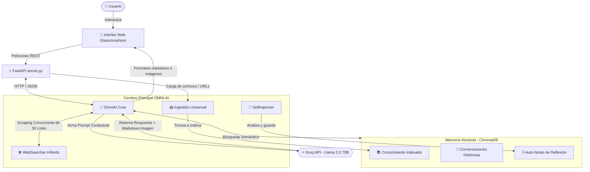

# 🧠 OMNI-AI · Sistema Cognitivo General con RAG Híbrido, Auto-aprendizaje y HUD de Voz

<div align="center">
  
  
  
  
  
</div>

<br />

**OMNI-AI** es un asistente cognitivo de inteligencia artificial avanzado y modular diseñado para funcionar 100% gratis en la nube mediante **Groq API** y embeddings locales. Cuenta con **RAG híbrido (memoria vectorial local + RAG en tiempo real de internet)**, **memoria persistente a largo plazo**, **auto-aprendizaje continuo**, **generador de imágenes integrado**, **personalidades de voz inteligentes** y una **interfaz gráfica web premium estilo glassmorphism holográfico**.

---

## 🌟 Características Principales (¡Nuevas Funcionalidades!)

### 🌐 1. Súper Escáner Concurrente Híbrido (RAG Web de 50 Links)
* **El Problema**: Las consultas convencionales de internet suelen bloquearse al leer más de 3 fuentes debido a redirecciones y restricciones TLS de servidores de noticias.
* **La Solución**: Implementamos un motor de búsqueda e ingesta en paralelo en [core/search.py](file:///c:/Users/LeinerSuarez/Desktop/Proyectos/Portafolio/AIIA/core/search.py) que descarga y analiza de forma concurrente con `ThreadPoolExecutor` hasta **50 enlaces simultáneos** usando una distribución híbrida:
  * **15% Wikipedia**: Respuestas documentales y enciclopédicas sumamente precisas.
  * **55% DuckDuckGo (Scraping Directo)**: Extrae URLs limpias, reales y altamente legibles.
  * **30% Google News**: Empleado como fallback para noticias calientes y titulares del día.
* **Meta-Análisis Científico 🔬**: Al activar este modo en la UI, el cerebro realiza una síntesis científica exhaustiva, cruzando y contrastando activamente de **8 a 15 fuentes**, detectando discrepancias o consensos y citando elegantemente con números de referencia `[1]`, `[2]`, `[3]`, etc.

### 🎨 2. Generador e Insertador de Imágenes al Vuelo (Pollinations.ai)
* **Cerebro Inteligente**: El núcleo intercepta peticiones de ilustración (ej: *"dibuja un astronauta cyberpunk"*), traduce el prompt al inglés detallando la estética de manera profesional (estilo render 3D, fotorrealista, etc.) y genera de forma automática una etiqueta markdown:
  ``
* **Renderizador UI Glassmorphism**: El formateador del chat intercepta las imágenes y las envuelve en un contenedor premium interactivo:
  * **Estética Premium**: Bordes ultra-redondeados, sombras dobles y halo translúcido cian.
  * **Micro-animaciones**: Zoom suave al pasar el mouse (`scale(1.02)`) con transiciones fluidas.
  * **Vista en Alta Resolución**: Haz clic en cualquier imagen generada para abrir la original a resolución completa en una nueva pestaña.
  * **Control de Errores Inteligent**: Un handler `onerror` oculta el contenedor fallido y renderiza un cuadro de advertencia estético si la API tiene problemas, garantizando que el diseño del chat nunca se rompa.

### 🎙️ 3. HUD de Voz con 4 Personalidades Inteligentes de W.D.
El HUD holográfico de voz cuenta con un selector de personalidades sincronizado con el menú de ajustes de la barra lateral:
* **W.D. (J.A.R.V.I.S.)**: Elegante, servicial y formal. Te llama *"Señor"* o *"Creador"*. Voz grave de ritmo pausado (`pitch: 0.92`, `rate: 0.95`).
* **F.R.I.D.A.Y.**: Tecnológica, proactiva y enérgica. Te llama *"Jefe"* o *"Boss"*. Voz femenina dinámica (`pitch: 1.15`, `rate: 1.05`) con beeps enérgicos en frecuencia alta.
* **T.A.R.S.**: Pragmático, directo y sumamente irónico de Interstellar. Te llama *"Compañero"*. Tono robótico de baja frecuencia (`pitch: 0.75`).
* **G.L.A.D.O.S.**: Fría, científica y sarcástica de Portal. Te llama *"Sujeto de pruebas"*. Tono sinusoidal metálico agudo (`pitch: 1.35`).
* *Cada cambio de personalidad emite un conjunto de ondas acústicas personalizadas sintetizadas mediante Web Audio API.*

### 🔄 4. Ciclo de Auto-Mejora (Self-Improvement)
* La IA evalúa autónomamente sus propias respuestas cada 3 turnos de conversación.
* Redacta notas de aprendizaje sobre qué pudo haber hecho mejor y las indexa en ChromaDB.
* Cada 15 turnos se auto-traza objetivos cognitivos concretos para optimizar respuestas futuras.

---

## 🏗️ Arquitectura del Sistema



---

## ⚙️ Requisitos Previos

* **Python 3.10 o superior** instalado.
* Una **API Key de Groq** (100% gratuita, se obtiene en menos de 2 minutos registrándote en [console.groq.com](https://console.groq.com/)).

---

## 🚀 Guía de Instalación Rápida

Sigue estos pasos para poner a funcionar OMNI-AI en tu máquina:

### 1. Clonar el repositorio y acceder
```bash
git clone https://github.com/yakross/OmniAI.git
cd OmniAI
```

### 2. Configurar el Entorno Virtual (Recomendado)
**En Windows (PowerShell/CMD):**
```powershell
python -m venv venv
venv\Scripts\activate
```
**En macOS / Linux:**
```bash
python3 -m venv venv
source venv/bin/activate
```

### 3. Instalar Dependencias
Una vez activado el entorno virtual `(venv)`, instala todas las librerías necesarias ejecutando:
```bash
pip install -r requirements.txt
pip install fastapi uvicorn python-multipart pypdf chromadb sentence-transformers groq bs4 requests
```

### 4. Configurar tu Clave API
Crea o edita el archivo en la ruta `config/.env` e introduce tu clave API de Groq:
```env
GROQ_API_KEY=gsk_TU_CLAVE_REAL_AQUI
```
> 🔒 **Nota de Seguridad:** El archivo `.env` está en el `.gitignore` por lo que tus credenciales siempre permanecerán seguras localmente y nunca se subirán a GitHub.

---

## 🖥️ ¿Cómo Ejecutar OMNI-AI?

### Opción A: Lanzador Rápido de Un Clic (Recomendado en Windows) ⚡
Para mayor comodidad, creamos el archivo ejecutable **`run_omni.bat`** en la raíz del proyecto.
1. Haz doble clic sobre **`run_omni.bat`**.
2. El script detectará tu entorno virtual, levantará el servidor de FastAPI en segundo plano y te abrirá automáticamente la consola web holográfica en tu navegador por defecto. ¡Listo para chatear y programar!

### Opción B: Ejecución Manual desde Consola
Si deseas ejecutarlo manualmente, activa tu entorno virtual y arranca el servidor API:
```bash
python server.py
```
Una vez iniciado el servidor:
1. Abre tu navegador y ve a: **`http://localhost:8000/ui/`**

---

## 📡 Endpoints de la API REST

Si deseas integrar OMNI-AI en otras aplicaciones, el servidor de FastAPI expone los siguientes puntos:

* **`POST /chat`**: Envía un mensaje y recibe una respuesta contextual con RAG, auto-mejora, personalidades y búsqueda en tiempo real.
  * **Parámetros del Body (JSON)**:
    * `message` (str, requerido)
    * `auto_improve` (bool, opcional - default `true`)
    * `web_search` (bool, opcional - default `false`)
    * `max_links` (int, opcional - default `5`, soporta hasta `50`)
    * `response_style` (str, opcional - default `"standard"`, opciones: `"short"`, `"long"`, `"code"`, `"creative"`)
    * `cognitive_depth` (str, opcional - default `"standard"`, opciones: `"standard"`, `"high"`)
    * `jarvis_personality` (str, opcional - default `"wd"`, opciones: `"wd"`, `"friday"`, `"tars"`, `"glados"`)
* **`POST /learn/file`**: Indexa archivos PDF y texto plano.
* **`POST /learn/url`**: Descarga y aprende de páginas web externas.
* **`POST /learn/text`**: Guarda notas o textos manuales de conocimiento.
* **`GET /status`**: Devuelve estadísticas de ChromaDB y del sistema cognitivo.
* **`GET /reflections`**: Obtiene las notas de auto-mejora generadas por la IA.
* **`GET /docs`**: Documentación interactiva de Swagger UI para pruebas de endpoints.

---

## 🛠️ Tecnologías Utilizadas

* **Lenguaje:** [Python 3](https://www.python.org/)
* **Framework API:** [FastAPI](https://fastapi.tiangolo.com/) y [Uvicorn](https://www.uvicorn.org/)
* **Vector DB:** [ChromaDB](https://www.trychroma.com/) (base de datos vectorial local empotrada)
* **LLM Engine:** [Groq Cloud](https://groq.com/) (Modelo LLaMA 3.3 70B & LLaMA 3.1 8B)
* **Modelos de Embeddings:** [Sentence-Transformers](https://sbert.net/) (`all-MiniLM-L6-v2` corriendo en CPU local)
* **Generación de Imágenes:** [Pollinations.ai](https://pollinations.ai/) (API libre)
* **Frontend:** HTML5, CSS3 Vanilla (Estilo Glassmorphism Responsivo con variables HSL) y Javascript (Web Speech Synthesis + Web Audio API).
